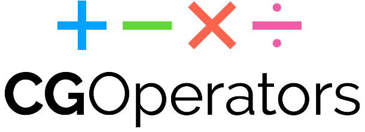

<p align="center">
    
</p>

<p align="center">
    <a href="https://cocoapods.org/pods/CGOperators">
        
    </a>
    <a href="https://github.com/Carthage/Carthage">
        
    </a>
    <a href="https://swift.org/package-manager">
        
    </a>
    <a href="https://github.com/JohnSundell/Marathon">
        
    </a>
    <a href="https://twitter.com/johnsundell">
        
    </a>
</p>

Welcome to `CGOperators`, a small Swift framework that enables you to easily manipulate Core Graphics' vector types (`CGPoint`, `CGSize` and `CGVector`) using math operators. It can help you write compact, yet highly readable code when dealing with things like image sizes and frame-based layouts.

## Examples

**Add two vectors**

```swift
let point = view.frame.origin + CGPoint(x: 10, y: 20)
let size = image.size + view.frame.size
let vector = physicsWorld.gravity + player.size
```

**Subtract two vectors**

```swift
let point = view.frame.origin - CGPoint(x: 10, y: 20)
let size = image.size - view.frame.size
let vector = physicsWorld.gravity - player.size
```

**Multiply a vector with a constant**

```swift
view.frame.size = image.size * 4
button.frame.origin = superview.bounds.size * 2
physicsWorld.gravity = player.position * 10
```

**Divide a vector by a constant**

```swift
view.frame.size = image.size / 4
button.frame.origin = superview.bounds.size / 2
physicsWorld.gravity = player.position / 10
```

## Installation

**Using [CocoaPods](https://cocoapods.org)**

Add `pod CGOperators` to your `Podfile`

**Using [Carthage](https://github.com/Carthage/Carthage)**

Add `git "JohnSundell/CGOperators"` to your `Cartfile`

**Using the [Swift Package Manager](https://github.com/apple/swift-package-manager)**

Add `Package(url: "https://github.com/JohnSundell/CGOperators.git", majorVersion: 1)` to your `Package.swift` file.

**Using [Marathon](https://github.com/JohnSundell/Marathon)**

Run `marathon add https://github.com/JohnSundell/CGOperators.git` on the command line.

## Help, feedback or suggestions?

- [Open an issue](https://github.com/JohnSundell/CGOperators/issues/new) if you need help, if you found a bug, or if you want to discuss a feature request.
- [Open a PR](https://github.com/JohnSundell/CGOperators/pull/new/master) if you want to make some change to `CGOperators`.
- Contact [@johnsundell on Twitter](https://twitter.com/johnsundell) for discussions, news & announcements about `CGOperators` and other open source projects.
